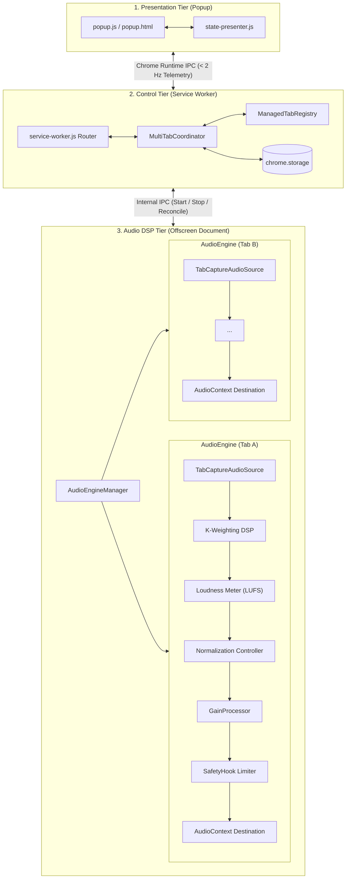

# WebAudioBalance

> **Smart Perceptual Audio Loudness Normalizer & Multi-Tab Audio Manager for Chromium Browsers**  
> *Built on Manifest V3 with ITU-R BS.1770-5 standard compliance.*

[](manifest.json)
[](#installation)
[](dist/RELEASE_NOTES_v1.1.1.md)
[](#verification--testing)
[](#audio-processing-specifications)
[](#license)
[](README_zh.md)

[English](README.md) | [简体中文](README_zh.md)

---

## 1. Overview

When browsing the web across multiple multimedia tabs—jumping between YouTube videos, Bilibili streams, Twitch broadcasts, podcasts, Spotify, and video conferences—audio levels fluctuate wildly. A quiet podcast can be suddenly followed by a blaring advertisement, and background music can drown out dialogue.

**WebAudioBalance** is a Chrome and Microsoft Edge extension that solves this problem through **real-time perceptual loudness normalization**. Instead of naive peak amplification (which causes distortion and pumping), WebAudioBalance measures true human-perceived loudness (LUFS) in accordance with the broadcast-grade **ITU-R BS.1770-5** standard, continuously and smoothly bringing every captured tab into a harmonious, balanced listening range.

---

## 2. Key Features

- **🎯 ITU-R BS.1770-5 Perceptual Normalization**:
  Calculates true human ear loudness response using standard K-weighting pre-filters (Head-shelf filter + RLB high-pass filter) and multi-slice energy integration (400ms Momentary and 3.0s Short-Term LUFS).
- **🎛️ Simultaneous Multi-Tab Balance**:
  Supports capturing and normalizing multiple audio-playing tabs concurrently. Each tab runs a dedicated, physically isolated `AudioEngine` without cross-tab distortion or interference.
- **🎚️ 3 Semantic Listening Presets**:
  - **Quiet (-24 LUFS)**: Relaxed, late-night listening without disturbing others.
  - **Normal (-18 LUFS)**: Balanced, comfortable standard for multimedia and music.
  - **Loud (-14 LUFS)**: High dialogue clarity, optimized for podcasts, interviews, and noisy environments.
- **🎚️ Per-Tab Relative Gain Offset**:
  Fine-tune any individual tab's volume with an intentional offset slider ($\pm 12\text{ dB}$) relative to the target level, while maintaining automatic normalization.
- **🛡️ Digital Peak Limiter & Hearing Protection**:
  An asymmetric gain processor with fast attack ($8.0\text{ dB/s}$) prevents sudden ear-piercing blasts. Built-in hard peak limiter (`SafetyHook`) at $-0.5\text{ dBFS}$ guarantees zero digital clipping distortion.
- **⚡ Manifest V3 Native Architecture**:
  Control plane in Service Worker, high-performance Web Audio DSP in Offscreen Document (`chrome.offscreen`), and interactive Popup presentation layer. Rate-bounded IPC ($\le 2\text{ Hz}$) prevents UI lag.
- **🔄 Active Self-Healing & State Reconciliation**:
  Clicking the Refresh button (🔄) automatically triggers end-to-end state reconciliation across Service Worker, Offscreen audio runtime, and open tabs to clear transient errors.
- **🔒 100% Local & Privacy-Preserving**:
  All audio processing and analysis runs entirely on-device inside your browser. No audio data, telemetry, or browsing history is ever transmitted over the network.

---

## 3. Architecture

WebAudioBalance separates concerns into three distinct execution tiers to conform strictly to Chrome Manifest V3 lifecycle constraints:



1. **Presentation Tier (`src/popup/`)**:
   Renders current and balanced tabs, listening level selectors, relative offset sliders, and diagnostic metrics. Decoupled from audio state via `state-presenter.js`.
2. **Control Tier (`src/control/`, `src/background/`)**:
   `MultiTabCoordinator` manages user intent, session persistence (`chrome.storage`), context menu actions, and tab lifecycle events (`tabs.onRemoved`, `tabs.onUpdated`).
3. **Audio DSP Tier (`src/offscreen/`, `src/engine/`)**:
   Hosted in an Offscreen Document with full DOM and Web Audio API support. `AudioEngineManager` maintains isolated per-tab `AudioEngine` pipelines.

---

## 4. Installation

### Option A: Install from Release Package (Recommended)

1. Download the latest `webaudiobalance-v1.1.1.zip` from [Releases](https://github.com/Chengy257/WebAudioBalance/releases/tag/v1.1.1) (or locate it in `dist/`).
2. Extract the ZIP archive to a local folder.
3. Open your browser's extension management page:
   - **Google Chrome**: Navigate to `chrome://extensions/`
   - **Microsoft Edge**: Navigate to `edge://extensions/`
4. Toggle **Developer mode** (top-right in Chrome, left sidebar in Edge) to **ON**.
5. Click **Load unpacked** (加载已解压的扩展程序).
6. Select the extracted folder containing `manifest.json`.

### Option B: Run from Source Repository

```bash
# Clone the repository
git clone https://github.com/Chengy257/WebAudioBalance.git
cd WebAudioBalance

# Install developer dependencies (optional, for running test suites)
npm install

# Load unpacked in Chrome/Edge pointing to the repository root directory
```

---

## 5. Usage Guide

### Balancing Audio Tabs

> **Browser Security Note**: Chromium security policy requires an explicit user gesture on an audible tab before audio stream capture can begin.

1. **Navigate to the Audio Tab**: Switch to any tab playing sound (e.g., YouTube, Bilibili, Twitch, Spotify Web).
2. **Open WebAudioBalance**: Click the extension icon in your browser toolbar, or right-click anywhere on the webpage and select **"WebAudioBalance: Balance this tab"**.
3. **Activate Balancing**: Click **[ Balance This Tab ]** under **Current Tab**. The tab will transition through `Balancing` and lock into `Balanced`.
4. **Manage Multiple Tabs**: Switch to any other tab playing audio and repeat steps 2–3. Both tabs will remain balanced concurrently.
5. **Adjust Listening Presets**: Use the master preset buttons in the header:
   - `Quiet` ($-24\text{ LUFS}$)
   - `Normal` ($-18\text{ LUFS}$)
   - `Loud` ($-14\text{ LUFS}$)
6. **Fine-Tune Relative Levels**: Drag the **Relative Level** slider ($\pm 12\text{ dB}$) on any tab card to make that specific source louder or quieter relative to others. Double-click the slider to reset to `0.0 dB (Normal)`.
7. **Diagnostics & Self-Healing**:
   - Click **🔄 (Refresh)** to trigger instant runtime state reconciliation and clear transient errors.
   - Click **⚙️ (Diagnostics)** to expand the real-time engineering metrics drawer (Source LUFS, Output LUFS, Applied Gain, Headroom, AudioContext State).

---

## 6. Audio Processing Specifications

| Parameter | Specification | Details / Rationale |
|---|---|---|
| **Loudness Standard** | ITU-R BS.1770-5 | High-shelf filter (+3.99 dB @ 1.5 kHz) + RLB high-pass (100 Hz) |
| **Momentary Window** | 400 ms | 4 consecutive 100ms rectangular energy slices |
| **Short-Term Window** | 3.0 s | 30 consecutive 100ms energy slices |
| **Dynamic Attack Rate** | 8.0 dB/s | Rapid attenuation to suppress sudden loud blasts |
| **Dynamic Release Rate** | 1.5 dB/s | Gentle gain restoration preventing unnatural breathing/pumping |
| **Control Deadband** | $\pm 0.5\text{ dB}$ | Prevents micro-gain flutter during steady audio |
| **Speech Pause Hold** | 1500 ms | Preserves loudness integration across conversational pauses |
| **Peak Limiter Ceiling** | $-0.5\text{ dBFS}$ | Absolute hard headroom safety to prevent digital clipping |
| **Relative Level Range** | $-12.0\text{ dB} \sim +12.0\text{ dB}$ | Continuous user preference offset |
| **Telemetry Rate Bound** | $\le 2\text{ Hz}$ | Minimum 500ms debounce interval across extension IPC |

---

## 7. Project Structure

```text
WebAudioBalance/
├── manifest.json                  # Manifest V3 extension configuration
├── package.json                   # Project metadata and test scripts
├── assets/
│   └── icons/                     # Extension icons (16, 32, 48, 128px)
├── src/
│   ├── background/
│   │   └── service-worker.js      # MV3 Service Worker (Control Plane)
│   ├── control/
│   │   ├── coordinator.js         # MultiTabCoordinator (Transaction orchestrator)
│   │   ├── registry.js            # ManagedTabRegistry (State management)
│   │   └── settings.js            # User settings persistence
│   ├── engine/
│   │   ├── audio-engine.js        # Individual tab WebAudio pipeline
│   │   ├── audio-source.js        # tabCapture MediaStream acquisition
│   │   ├── gain-processor.js      # Smooth asymmetric gain controller
│   │   ├── k-weighting.js         # ITU-R BS.1770 K-weighting biquad filter
│   │   ├── loudness-meter.js      # Real-time LUFS energy meter
│   │   ├── normalization-controller.js # Normalization convergence logic
│   │   ├── activity-detector.js   # Voice & signal activity detection
│   │   ├── safety.js              # DynamicsCompressor peak safety limiter
│   │   └── dsp/
│   │       ├── biquad-core.js     # Direct Form II transposed biquad core
│   │       ├── k-weighting-core.js# Standard filter coefficient tables
│   │       └── loudness-core.js   # Multi-slice sliding window LUFS calculator
│   ├── offscreen/
│   │   ├── offscreen.html         # Offscreen Document DOM host
│   │   ├── offscreen.js           # Offscreen entrypoint & IPC router
│   │   └── audio-engine-manager.js# Manager for active AudioEngine instances
│   ├── popup/
│   │   ├── popup.html             # Presentation popup interface
│   │   ├── popup.css              # Responsive dark/light styling
│   │   ├── popup.js               # Presentation logic and event handlers
│   │   └── state-presenter.js     # UI state formatting & error mapping
│   └── shared/
│       ├── messages.js            # IPC message types & target schemas
│       ├── failure-taxonomy.js    # Error codes and user-actionable descriptions
│       └── logger.js              # Standardized structured logging
├── scripts/
│   ├── package-release.mjs        # Production CRX & ZIP packaging script
│   └── start-poc.mjs              # Browser launch helper for development
├── test/                          # Unit and integration test suites
│   ├── test-r1-audio-core.mjs     # Audio DSP & BS.1770 unit tests
│   ├── test-r2-runtime-state.mjs  # Coordinator & state reliability tests
│   ├── test-r3-ui.mjs             # Presentation logic & UI state tests
│   ├── test-ra-authorization-recovery.mjs # TabCapture authorization tests
│   └── verify-release-artifact.mjs# Chrome & Edge automated package verification
└── dist/                          # Production release packages and checksums
```

---

## 8. Verification & Testing

WebAudioBalance contains an extensive automated test suite covering DSP accuracy, state coordination, UI formatting, and real-browser package verification.

```bash
# Run all unit and regression test suites (137 tests, 100% pass)
npm test

# Run individual test suites
npm run test:r1       # Audio DSP & ITU-R BS.1770 core tests
npm run test:r2       # Runtime state & coordinator tests
npm run test:r3       # Product UI & state presenter tests
npm run test:ra       # Authorization & multi-tab recovery tests

# Build distribution packages (ZIP, CRX, SHA-256 checksums)
npm run package

# Automatically verify release packages inside Chrome and Edge instances
npm run verify:release
```

---

## 9. Privacy & Permissions

WebAudioBalance is engineered with a strict **privacy-first** approach:

- **Permissions Explained**:
  - `tabCapture`: Required to capture the audio stream of the specific tab you select.
  - `offscreen`: Required to create an Offscreen Document for Web Audio API processing in Manifest V3.
  - `tabs` / `activeTab`: Required to identify audible tabs and provide tab switching shortcuts.
  - `contextMenus`: Adds the convenient *"WebAudioBalance: Balance this tab"* right-click shortcut.
  - `storage`: Saves your listening level presets and relative volume preferences locally.
- **Zero External Connections**: WebAudioBalance contains no analytics, no external tracking scripts, and never transmits audio or metadata outside your machine.
- **Purely Local Audio Processing**: All PCM data flows strictly between the browser's audio capture and output devices via local Web Audio nodes.

---

## 10. License

All rights reserved. License terms to be determined by the project owner.
