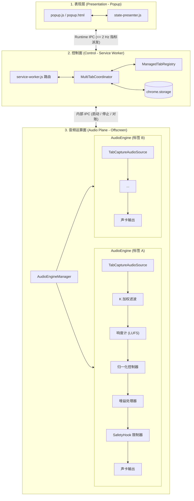

# WebAudioBalance

> **面向 Chromium 内核浏览器的智能感知响度平衡与多标签音量管理器**  
> *基于 Manifest V3 架构，严格遵循 ITU-R BS.1770-5 广播级响度规范。*

[](manifest.json)
[](#安装方法)
[](dist/RELEASE_NOTES_v1.1.1.md)
[](#验证与测试)
[](#音频处理算法技术规格)
[](LICENSE)
[](README.md)

[English](README.md) | [简体中文](README_zh.md)

---

## 1. 项目概述

在日常使用浏览器时，在多个网页间切换（例如 Bilibili 视频、YouTube、Twitch 直播、播客、音乐播放器或在线视频会议）经常会遇到**各个网页音量高低不一**的问题。有时刚听完一个微弱的访谈，突然跳出的广告或下一个视频就会爆音刺耳；或是背景音乐过响盖过了人声。

**WebAudioBalance** 是一款专为 Google Chrome 和 Microsoft Edge 开发的浏览器扩展，通过**实时感知响度归一化算法**彻底解决这一痛点。它摒弃了简单粗暴的峰值压缩（传统压缩极易引起爆音、失真或呼吸声效应），严格依照广播级 **ITU-R BS.1770-5** 标准精确度量人耳感知响度（LUFS），并平滑、自适应地将所有被捕获网页的音量动态调整到均匀、舒适的听音区间。

---

## 2. 核心特性

- **🎯 ITU-R BS.1770-5 广播级感知响度算法**：
  采用标准的 K 加权滤波预处理（高架头部滤波器 + RLB 高通滤波）与多切片能量滑动积分（400ms 瞬时响度与 3.0s 短时响度 LUFS），真实模拟人耳对各频段的感知响度。
- **🎛️ 多标签页并发独立平衡**：
  支持同时捕获并独立平衡多个发声标签页。每个标签页运行在相互物理隔离的 `AudioEngine` 实例中，互不串扰、互不影响。
- **🎚️ 3 档语义化听音预设**：
  - **Quiet 柔和 (-24 LUFS)**：适合深夜或安静环境下聆听，柔和舒适，不影响他人。
  - **Normal 标准 (-18 LUFS)**：流媒体与音乐的推荐标准平衡档位。
  - **Loud 清晰 (-14 LUFS)**：突出人声对白与细节，适合访谈、播客及嘈杂环境。
- **🎚️ 单标签相对增益微调**：
  在保持全局自动平衡的前提下，每个标签页卡片均配有独立的 $\pm 12\text{ dB}$ 相对音量微调滑块，满足个性化偏好。
- **🛡️ 数字防破音与听力保护**：
  非对称动态增益斜坡配合毫秒级快速压制（$8.0\text{ dB/s}$ Attack），防止突发大音量爆音；链路末端硬阈值限制器（`SafetyHook` @ $-0.5\text{ dBFS}$）杜绝数字削波失真。
- **⚡ Manifest V3 原生架构设计**：
  Service Worker 作为控制面路由器，离屏文档（Offscreen Document）承载高精度 Web Audio DSP 运算，Popup 负责交互呈现。IPC 派发频率严格约束在 $\le 2\text{ Hz}$，绝不卡顿浏览器界面。
- **🔄 状态主动自愈与一键刷新**：
  点击刷新按钮（🔄）即可主动触发 Service Worker、离屏音频运行时与各网页之间的全量状态对账，瞬态错误自动恢复。
- **🔒 100% 本地运算与隐私安全**：
  所有音频采集与数字信号处理完全运行于本机浏览器沙箱内，无任何外发网络请求，不收集任何用户隐私或网页历史。

---

## 3. 系统架构

严格遵循 Chrome Manifest V3 生命周期规范，将职责划分为清晰的三层架构：



1. **表现层 (`src/popup/`)**：
   负责渲染当前标签与已平衡标签卡片、音量预设切换、相对增益滑块与工程诊断抽屉。
2. **控制面 (`src/control/`, `src/background/`)**：
   `MultiTabCoordinator` 统一调度用户管理意图、会话存储与生命周期事件（如标签页关闭、刷新或唤醒）。
3. **音频面 (`src/offscreen/`, `src/engine/`)**：
   托管在具备完整 DOM 与 Web Audio API 支持的 Offscreen Document 中，为每个标签页维护独立的音频处理链路。

---

## 4. 安装方法

### 方式一：加载发布版本（推荐）

1. 在 [Releases](https://github.com/Chengy257/WebAudioBalance/releases/tag/v1.1.1) 页面下载最新的 `webaudiobalance-v1.1.1.zip`（或使用仓库 `dist/` 目录下的压缩包）；
2. 将 ZIP 压缩包解压到本地文件夹；
3. 打开浏览器的扩展管理页面：
   - **Google Chrome**：访问 `chrome://extensions/`
   - **Microsoft Edge**：访问 `edge://extensions/`
4. 开启右上角（Edge 为左侧）的 **“开发者模式”**（Developer mode）；
5. 点击 **“加载已解压的扩展程序”**（Load unpacked）；
6. 选择解压后包含 `manifest.json` 的文件夹即可完成安装。

### 方式二：从源码运行

```bash
# 克隆仓库
git clone https://github.com/Chengy257/WebAudioBalance.git
cd WebAudioBalance

# 安装依赖（可选，用于运行单元测试与校验脚本）
npm install

# 按照上述步骤在浏览器中“加载已解压的扩展程序”，直接选择仓库根目录
```

---

## 5. 使用指南

### 开启网页音量平衡

> **安全须知**：根据 Chromium 内核的安全规范，扩展程序必须在用户位于该发声标签页且产生显式交互手势后，方可捕获音频流。

1. **进入目标发声网页**：切换到正在播放声音的网页（如 Bilibili、YouTube、网页版网易云音乐等）；
2. **唤起 WebAudioBalance**：点击浏览器右上角工具栏的扩展图标，或在网页任意位置点击右键选择 **“WebAudioBalance: Balance this tab”**；
3. **开启平衡**：在“当前标签页”卡片下方点击 **[ Balance This Tab ]**。状态将从 `Balancing` 平滑过渡至 `Balanced`；
4. **管理多个标签页**：切换至其他发声标签页重复上述步骤。所有开启的网页均会同时在后台维持平衡；
5. **调节目标听音档位**：点击顶部导航栏中的 `Quiet`、`Normal` 或 `Loud` 快捷切换全局目标；
6. **单独微调某个网页**：拖动卡片上的 **Relative Level** 滑块（$\pm 12\text{ dB}$）可让该网页比其他网页相对更响或更柔和。双击滑块可复位为 `0.0 dB (Normal)`；
7. **诊断与自愈**：
   - 点击顶部 **🔄 (刷新)** 按钮：触发底层运行时状态的主动对账，自愈瞬态异常；
   - 点击顶部 **⚙️ (齿轮)** 按钮：平滑滚动展开底部工程诊断抽屉，实时查看源响度、输出响度、生效增益与声卡运行状态。

---

## 6. 音频处理算法技术规格

| 参数项 | 技术规格 | 说明与设计考量 |
|---|---|---|
| **响度规范标准** | ITU-R BS.1770-5 | 头部高架滤波 (+3.99 dB @ 1.5 kHz) + RLB 100 Hz 高通滤波 |
| **瞬时响度窗口 (Momentary)** | 400 ms | 4 个连续 100ms 矩形滑动切片 |
| **短时响度窗口 (Short-Term)** | 3.0 s | 30 个连续 100ms 滑动切片积分 |
| **动态压制速率 (Attack)** | 8.0 dB/s | 迅速压制突发大音量，保护用户听力 |
| **动态提升速率 (Release)** | 1.5 dB/s | 柔和缓慢抬升增益，避免呼吸效应与底噪浮动 |
| **控制死区 (Deadband)** | $\pm 0.5\text{ dB}$ | 稳态音频中微小波动不引发增益扰动 |
| **语间停顿驻留** | 1500 ms | 说话断句停顿时保留短时积分，防止微弱声源重置增益 |
| **防削波限制器阈值** | $-0.5\text{ dBFS}$ | 严格防止输出数字削波破音 |
| **相对微调范围** | $-12.0\text{ dB} \sim +12.0\text{ dB}$ | 满足用户对单标签音量的个性化主观偏好 |
| **IPC 通信频次约束** | $\le 2\text{ Hz}$ | 最小 500ms 节流防抖，保障扩展界面流畅 |

---

## 7. 项目文件结构

```text
WebAudioBalance/
├── manifest.json                  # Manifest V3 扩展配置文件
├── package.json                   # 项目元数据与脚本
├── assets/
│   └── icons/                     # 扩展图标文件 (16, 32, 48, 128px)
├── src/
│   ├── background/
│   │   └── service-worker.js      # MV3 Service Worker (控制面路由)
│   ├── control/
│   │   ├── coordinator.js         # MultiTabCoordinator (跨标签事务协调器)
│   │   ├── registry.js            # ManagedTabRegistry (标签状态注册表)
│   │   └── settings.js            # 用户持久化配置管理
│   ├── engine/
│   │   ├── audio-engine.js        # 单标签页 WebAudio 核心管线
│   │   ├── audio-source.js        # tabCapture 媒体流采集
│   │   ├── gain-processor.js      # 平滑非对称增益控制器
│   │   ├── k-weighting.js         # ITU-R BS.1770 K 加权二阶滤波器
│   │   ├── loudness-meter.js      # 实时 LUFS 响度能量计算器
│   │   ├── normalization-controller.js # 响度收敛控制算法
│   │   ├── activity-detector.js   # 语音与信号发声活动检测
│   │   ├── safety.js              # DynamicsCompressor 防爆音限制器
│   │   └── dsp/
│   │       ├── biquad-core.js     # Direct Form II 转置二阶滤波核心
│   │       ├── k-weighting-core.js# 标准滤波系数表
│   │       └── loudness-core.js   # 多切片滑动窗口响度运算核心
│   ├── offscreen/
│   │   ├── offscreen.html         # 离屏文档宿主 DOM 容器
│   │   ├── offscreen.js           # 离屏文档入口与 IPC 路由
│   │   └── audio-engine-manager.js# 多引擎生命周期管理器
│   ├── popup/
│   │   ├── popup.html             # 弹出层界面
│   │   ├── popup.css              # 现代化响应式样式
│   │   ├── popup.js               # 弹出层交互逻辑
│   │   └── state-presenter.js     # 状态映射与错误展示逻辑
│   └── shared/
│       ├── messages.js            # IPC 消息契约与规范
│       ├── failure-taxonomy.js    # 错误码与用户动作映射表
│       └── logger.js              # 结构化日志工具
├── scripts/
│   ├── package-release.mjs        # 自动化打包脚本 (ZIP, CRX, 校验和)
│   └── start-poc.mjs              # 开发调试快捷启动脚本
├── test/                          # 自动化测试套件
│   ├── test-r1-audio-core.mjs     # 音频 DSP 与 BS.1770 算法测试
│   ├── test-r2-runtime-state.mjs  # 状态协调器与生命周期可靠性测试
│   ├── test-r3-ui.mjs             # 弹出层交互与状态格式化测试
│   ├── test-ra-authorization-recovery.mjs # 授权与多标签自愈测试
│   └── verify-release-artifact.mjs# Chrome & Edge 真实浏览器发布包自动化校验
└── dist/                          # 生产发布包与校验和文件
```

---

## 8. 验证与测试

项目具备完整的端到端自动化测试套件，全面覆盖 DSP 精确度、生命周期对账、UI 状态展示及真实浏览器加载门禁：

```bash
# 运行全量单元与回归测试套件 (137 项测试，100% 通过)
npm test

# 运行各独立专项测试
npm run test:r1       # 音频 DSP 与 ITU-R BS.1770 核心算法测试
npm run test:r2       # 运行时状态与 Coordinator 协调器测试
npm run test:r3       # 产品 UI 交互与状态呈现器测试
npm run test:ra       # 授权机制与多标签恢复测试

# 构建生产发布包 (生成 ZIP、CRX 及 SHA-256 校验和)
npm run package

# 在真实 Chrome 与 Edge 浏览器中自动化校验发布包完整性
npm run verify:release
```

---

## 9. 隐私声明与权限说明

WebAudioBalance 严格坚持**本地优先与隐私第一**的工程设计原则：

- **权限申请说明**：
  - `tabCapture`：仅用于获取您主动选择平衡的网页的音频流；
  - `offscreen`：在 Manifest V3 环境下创建后台离屏文档以执行 Web Audio 运算；
  - `tabs` / `activeTab`：用于检测发声标签页并提供快捷切换引导；
  - `contextMenus`：提供网页右键快速“平衡该标签”的快捷入口；
  - `storage`：在本地保存您的听音预设档位与相对音量滑块偏好。
- **绝无外部网络通信**：本扩展不包含任何数据埋点、不引入任何外部统计分析代码，绝不向任何远程服务器传输任何音频、浏览记录或元数据。
- **纯本地运算**：所有音频 PCM 流仅在浏览器内部的音频节点间流转，完全由本地 CPU 运算并输出至系统声卡。

---

## 10. 开源协议 (License)

本项目基于 [Apache License 2.0](LICENSE) 协议开源，详情请参阅项目根目录下的 LICENSE 文件。
